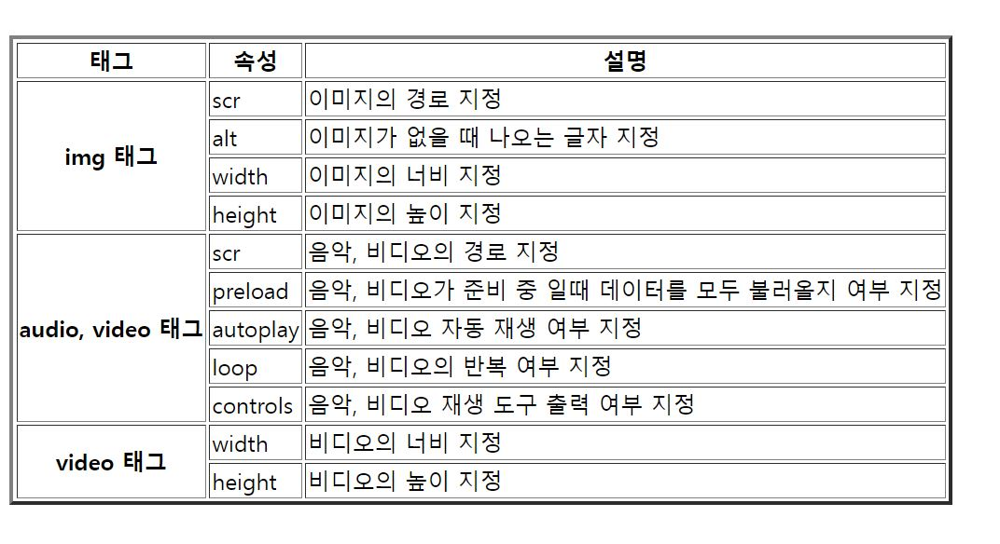

# 1. HTML

> HyperText Markup Language

- 온라인 상의 문서를 만들기 위해 데이터를 마크업(구조화)하는 언어

## 1-1. HTML 파일 구조

- `<!DOCTYPE html>` : HTML5 문서 규약으로 만들어진 웹 문서임을 표시

- `<html>`
  
  - 현재 파일이 HTML 문서라는 지시사항을 나타내는 태그로 HTML 문서의 처음과 끝에 나타남
  
  - 사이에 head와 body가 들어감
  
  - `<html lang="ko">` 
  
    | lang 속성값 | 언어     |
    | ----------- | -------- |
    | ko          | 한국어   |
    | en          | 영어     |
    | ja          | 일본어   |
    | ru          | 러시아어 |
    | zh          | 중국어   |
    | de          | 독일어   |
  
  
  
- `<head>`

  - HTML 문서에 대한 일반적인 정보를 표시하는 머리말 역할

  - 실제 브라우저에는 출력되지 않음
    - `<meta>` : 문서의 기본정보, 로봇 배제 표준이나 변경 URL으로의 이동 등을 설정할 수 있음(부가정보담당)
    - `<title>` : 문서의 제목, 현재 작성된 HTML 문서의 제목을 표기하는 태그, **브라우저의 제목 표시줄에 나타남**
    - `<script>` : javascript 등
    - `<style>` : css 등
    - `<link>` : 외부 문서 연결
    - `<base>` : 웹 페이지의 기본 경로 지정
    
    

- `<body>` : HTML 문서의 본문을 작성하는 곳으로 **브라우저 화면에 보여지는 부분** (문서의 내용)

## 1-2. HTML의 구성

**`
 Welcome! 
`**

- `
`  :  여는 태그
- `
`  :  닫는 태그
- `style="color:blue;" ` :  속성 (해당 태그에 적용되는 기능)
- `Welcome!`  :  해당 요소의 내용
- `
 Welcome! 
`  :  요소 (태그와 문서 내용)

## 1-3. 태그의 특징

- 대소문자를 구별하지 않음
- 공백문자나 개행 문자를 무시하여 여러 번 반복된 스페이스(공백)나 리턴(줄바꿈)에 대해 한 번만 인식함
- 특수한 기호를 이용해 공백 및 특수문자를 입력할 수 있음

| 특수문자 표현 |  설명  |
| :-----------: | :----: |
|   `&nbsp;`    |  공백  |
|    `&lt;`     |   <    |
|    `&gt;`     |   >    |
|   `&quot;`    |   "    |
|    `&amp;`    |   &    |
|   `&copy;`    | &copy; |

## 1-4. 요소와 속성

- 속성은 요소에 추가 정보를 주기 위해 사용
- 하나 이상의 속성을 표현하려면 여러 속성 사이의 구분은 공백으로 함
- 이름과 값 사이에는 '=' 문자를 사용하고 값은 "값" 또는 '값'처럼 큰 따옴표나 작은 따옴표에 감싸서 표현

<블록 요소>

- 줄 바꿈
- 블록 요소 안에 텍스트와 인라인 요소 포함 가능
- 블록 요소 안에 블록 요소 포함 가능(일부 불가능有)

<인라인 요소>

- 줄 바꿈 없음
- 인라인 요소 안에 텍스트와 인라인 요소 포함 가능
- 인라인 요소 안에 블록 요소 포함 불가

# 2. HTML 기본 태그

## 2-1. 단락 제목과 줄

### `<h1>`요소 : 제목(headline)

`<h1>`~`<h6>` : 1이 가장 큰 글씨체를 나타내고, 숫자가 커질 수록 글자가 작아짐

블록요소

### `
`요소 : 단락(paragraph)

절이나 단락을 구분하는 요소, 블록요소

줄 바꿈과 동시에 `
`요소 앞뒤에 약간의 여백이 자동으로 추가됨

### `
` 요소 : 

블록요소, 레이아웃 계층 나누기(영역구분) 용도

각 영역의 용도를 구분하는 기능이므로 다른 블록 요소를 하위에 포함 가능

### `` 요소 : 

인라인 요소, 문자 단락 용도

### `<a>`요소 : 하이퍼링크 생성(anchor)

다른 웹 페이지나 웹 페이지 내부의 특정 위치로 이동할 때 사용

* `<a href="이동할 웹 페이지 주소" title="설명내용">텍스트</a>` : 내용 부분의 텍스트 클릭 시 입력한 웹 페이지 주소로 이동
  * title 속성 : 마우스를 텍스트에 가져다 대면 뜨는 설명 부분(옵션)
  * target 속성 : 연결된 웹 문서를 여는 위치 지정
    * _self : 현재 창에서 열기(기본값)
    * _blank : 새 창 또는 새 탭에서 열기
    * _parent : 부모 프레임 창에서 열기(현재 프레임의 상위 프레임에서 열기)
    * _top : 최상위 프레임 창에서 열기
    * 프레임 이름 : 이름이 지정된 프레임 위치에서 열기

* `<a href="#id값">`텍스트`</a>` : 내용 부분의 텍스트 클릭 시 웹페이지 내부의 id값이 같은 위치로 이동

* 내용 부분에 텍스트 말고, 미디어 파일을 입력할 수도 있음 -> 이미지를 누르면 해당 링크로 이동

### ` `요소 : 줄바꿈(line break) 

줄바꿈을 하기 위해 사용

연속해서 사용하면 여러 줄의 빈 줄 삽입이 가능함

### `
`요소 : 가로줄(horizontal line)

문단 간 혹은 내용 사이에 구분을 할 때 사용

아무 속성도 사용하지 않으면 기본적으로 선의 길이가 화면 크기에 맞추어 나오게 되고, 음각된 선이 그어짐

`
` 로 작성하면 그림자 없는 가로줄을 그음

## 2-2. 단락 꾸미기

### `<pre>`요소 : 작성된 형식 유지(pre-formatted text)

화면에 입력한 상태 그대로 보이고자 할 때 사용

공백문자(빈칸, 탭, 줄 바꿈)을 그대로 표현

### `<blockquote>`요소 : 단락 인용

다른 글의 내용을 단락 단위로 인용

들여쓰기로 구분하여 표시함

## 2-3. 텍스트 꾸미기

### `<b>`요소 : 진하게

### `<strong>`요소 : 강하게

### `<i>`요소 : 기울임

### `<em>`요소 : 텍스트 강조

### `<small>`요소 : 작은 텍스트, 코멘트

### ``요소 : 위 첨자

### ``요소 : 아래첨자

### `<ins>`요소 : 내용 추가

### `<del>`요소 : 내용 삭제

# 3. 목록 나열하기

## 3-1. 순서 있는 목록

**`<ol>`요소 (Ordered List)**

순서가 있는 목록을 적을 때 사용

나열된 항목에는 하위 요소인 `<li>`를 사용

## 3-2. 순서 없는 목록

**`<ul>`요소 (Unordered List)**

순서가 없는 목록을 적을 때 사용

나열된 항목에는 하위 요소인 `<li>`를 사용

## 3-3.정의 목록

**`<dl>`요소 (Description List/Definition List)**

사전처럼 용어를 설명하는 목록을 만들 때 사용

용어는 `<dt>`요소, 설명은 `<dd>`요소를 사용

# 4. 테이블 만들기

| 태그      | 설명            |
| --------- | --------------- |
| `<table>` | 표 삽입         |
| `<tr>`    | 표에 행 삽입    |
| `<th>`    | 표 제목 셀 생성 |
| `< td>`   | 표 내용 셀 생성 |

- `<table>` 태그의 속성 :  `border="1" `와 같이 택 안에 요소를 지정하면 표의 테두리 두께 지정 가능

  - cologroup 태그와 col 태그로 테이블의 각 열에 설정을 줄 수 있음(th태그와 col태그의 수가 동일해야 함)

    `<colgroup>`

    ​		`<col width="100px" style="background-color; blue"/>`

    ​		`<col width="200px">`

    ​		`<col width="200px">`

    ​		`<col width="200px">`

    `<colgroup>`

- `<th>, <td>`태그의 속성 

  - colspan : 셀의 너비 지정
  - rowspan : 셀의 높이 지정

  

# 5. 미디어 넣기

이미지, 오디오, 비디오 등 멀티미디어를 삽입할 수 있음

| 내용을 갖을 수 없는 태그 | 내용을 가질 수 있는 태그 |
| ------------------------ | ------------------------ |
| ``                 | `<audio>, <video>`       |

* 웹 브라우저에서 지원하는 확장자 형식이 달라 미디어가 제대로 실행되지 않을 경우가 있음
  * 여러 확장자로 파일을 준비한 후 입력해  source 태그로 해결이 가능함.
  * soure 태그를 audio 태그나 video 태그 내부에 입력한 후, 속성으로 경로를 지정하고(src 속성사용), type 속성을 지정함.
    *  오디오 파일일 경우 type="audio/확장자명"을 입력
    * 비디오 파일일 경우 type="video/확장자명"을 입력

* 동영상을 불러올 때 대기 이미지 보여주기
  * `<video poster="이미지 주소">`
  * video 태그에 poster 속성을 사용해 대기시 이미지를 설정할 수 있음

* HTML5에서 추가된 이미지 요소
  * `<figure></figure>` : 그림, 사진, 다이어그램과 텍스트 등의 콘텐츠를 함께 묶어서 하나의 독립된 단위로 취급할 때 사용, figure 태그 내부에 figcaption 요소와 미디어 요소를 입력
  * `<figcaption></figcaption>` : figure 요소의 제목을 작성하는 요소로 한 번만 작성

* map 기능을 통해 이미지의 특정 부분에 링크 걸기

​    ``

**usemap 속성과 map 태그의 name 속성의 값을 동일하게 지정**

 ` <map name="my">`

   ` <area shape="rect" coords="25, 25, 175, 175" href="index.html" alt="그림일껄?">`

`  </map>`

# 6. 브라우저 내에 또 다른 페이지 삽입하기 

`<ifame src="삽입할 주소" width="폭" height="높이"></ifame>`

* scr 속성 : 브라우저 페이지 내에 입력할 페이지 주소 작성
* width와 height 속성 : 브라우저 프레임의 가로와 높이 지정
* name 속성 : 프레임의 이름
  * 사용 예) `<a>`요소의 target 속성에 `<iframe>` 이름을 지정할 때 이 name 속성에 작성한 내용을 입력하면 됨

# 7. 입력 양식 만들기

* 사용자로부터 정보를 받을 때 사용

* form 요소 내 사용자의 정보 입력 양식을 통해 받은 데이터를 서버에 전달

* `<form>`태그를 이용하여 입력 양식의 틀을 지정
  * form 태그 안에 들어가는 속성
    * name="이름"  : 폼 요소에 대한 이름
    * action="전송 위치"  : 데이터를 전송할 목적지 주소
    * method="get/post"
      * get 방식 : 주소에 데이터를 입력하여 전송(엽서)
      * post 방식 : 비밀스럽게 데이터 전송(편지)

## 7-1. input 태그

**`<input>`의 type 종류**

* type="text" : 글자입력 양식 생성

`<input type="text" name="변수명" value="초기값"/>`

name 속성 : 애플리케이션에 전달될 변수명

value 속성 : 입력창 초기 문자로 입력 받은 값을 전달(옵션)

* type="file" : 파일입력 양식 생성

​    `<input type="file" name="myfile"/>`

​	입력한 파일을 myfile이라는 이름으로 전달

* type="password" : 비밀번호 입력 양식 생성

​	`<input type="password" name="변수명"/>`

​	보안에 필요한 문자 입력. '●'으로 표시되지만 이 이상의 보호 기능은 없음

* type="hidden" 

  `<input type="hidden" name="변수명" value="값"/>`

  * 사용자가 입력하는 정보는 아님. 

  * 화면상에서는 해당 내용 표시를 하지 않아 보이지 않지만 값을 받아 전송

  * 시스템에서 특정 데이터를 처리하고 싶을 때 사용함

    예) 사용자 IP주소

* type="image" : 이미지 형태 생성

​	`<input type="image" scr="이미지파일 경로" alt="대체 문자열"/>`

​	alt 속성 : 이미지 파일이 화면에 나타나지 못할 때 대체로 나올 문자열 지정

* type="radio" : 라디오 버튼 양식 생성(동그란 버튼)

  `<input type="radio" name="member" value="yes" checked/> 회원`

  `<input type="radio" name="member" value="no"/> 비회원 `

  * name 속성값이 같은 그룹에서 value값을 하나만 선택하여 전달(단일 선택) -> 같은 name으로 여러 선택지를 만들고 하나를 선택하게 함.
  * checked 속성 : 미리 선택하게 나옴 (위의 예시의 경우 회원의 라디오 박스를 미리 선택함)

* type="checkbox" : 체크 박스 생성

​	`<input type="checkbox" name="hobby" value="book" checked/> 독서`

​    `<input type="checkbox" name="hobby" value="music"/> 음악`

​    `<input type="checkbox" name="hobby" value="movie"/> 영화`

 	name 속성 값이 겉은 그룹에서 선택한 value 값 다수를 전달(중복 선택) 

* type="button" : 버튼 생성

​	`<input type="button" value="버튼에 나올 텍스트"/>`

​	value 속성 : 생성한 버튼에 나올 텍스트 지정

* type="reset" : 초기화 버튼 생성

  `<input type="reset" value="초기화/취소"/>`

  value 속성 : 생성한 버튼에 나올 텍스트 지정

* type="submit" : 제출 버튼 생성

​	`<input type="submit" value="확인/신청/보내기/전송">`

​	value 속성 : 생성한 버튼에 나올 텍스트 지정

## 7-2. textarea 태그

`<textarea name="이름" cols="열의 수" rows="행의 수">기본입력내용</textarea>`

여러 행의 글자입력 양식 생성, 표시 영역보다많은 텍스트 입력시 스크롤바가 생성됨

* `<textarea>`의 속성
* name : 애플리케이션에 전달될 변수명
* cols : 텍스트 공간의 너비 지정
* rows : 텍스트 공간의 높이 지정
* value : 초기 입력 값

## 7-3. select 태그

`<select name="job" size="1" multiple="multiple">`

​	`<optgroup label="not adult">`

 			`<option value="elementary" selected>초등학생</option>`

​			`<option value="middle">중학생</option>`

​			`<option value="high">고등학생</option>`

​	`<optgroup/>`

​	`<optgroup label="adult">`

​			`<option value="company">회사원</option>`

​			`<option value="sales">자양업</option>`

​	`<optgroup/>`

선택 양식 생성. 최근에는 일반상황에서도 select 태그 대신 웹 페이지와 어울리게 자바스크립트를 사용해 하나하나 만드는 추세임.

* `<optgroup>` : 옵션 그룹화
* `<option>` : 옵션 생성
* `<multiple="multiple">` : 다중 선택하기 설정. `ctrl`을 누르면서 선택해야 다중 선택이 됨.

## 7-4. fieldset 태그와 legend 태그

* `<fieldset>` : 입력 양식의 그룹 생성

  폼 양식을 그룹핑하는 범위를 지정해 사용자의 시각적 편의를 위해 사용

  * name 속성 : 그룹의 이름을 지정

  * form 속성 : 폼과 연결

  * disabled 속성 : 그룹 내의 모든 하위 입력 요소들을 비활성화 예) 비회원인 경우 입력하지 못함

* `<legend>` 의 속성 : 입력 양식 그룹의 이름 지정

​		그룹을 구분하기 위한 그룹의 제목 라벨로 fieldset 요소에 포함되는 첫 번째 자식 요소(한 번만 사용)

## 7-5. label 태그

`<label for="입력 아이디"></label>`

버튼 이외의 텍스트 영역을 선택해도 버튼이 선택이 되게 하는 기능(선택 영역을 확대시키는 역할)

`<label for="female">여성</label>`

`<input type="radio" name="sex" id="female" value="f"/>`

`<label for="male">남성</label>`

`<input type="radio" name="sex" id="male" value="m"/>`

여성이라는 문자를 클릭하면 라벨의 for 속성으로 가지고 있는 문자열과 같은 id를 가지고 있는 라디오 버튼이 선택됨

## 7-6. 서식이 있는 텍스트 입력

* 유효성 섬사

  유효성 검사가 가능한 태그 안에 required 속성(유효성 검사 실시) 또는 novalidate 속성(유효성 검사 제외)을 입력

  * 이메일 입력 필드에 다른 형식이 입력되었거나 필수적으로 입력해야 하는 필드가 입력 되지 않았을 때 폼을 전송하지 않음
  *  `<input>`, ` <select>`, ` <textarea>`, ` <button>`, ` <submit>` 일때 유효성 검사 가능

* 이메일 주소 입력 양식

  `<input type="email"/>`

  이메일 주소가 실제로 존재하는지는 확인하지 못하지만, 형식이 맞게 작성되었는지 확인함

* URL 주소입력 양식

  `<input type="url"/>`

  인터넷 주소 표기 규정에 맞게 "http://"가 작성되었는지 확인

  value 속성으로 미리 "http://"를 설정할 수 있음

* 전화번호 입력 양식

  ​	`<input type="tel">`

  * pattern 속성 : 원하는 전화번호와 자리수에 유효한 패턴을 지정
    * pattern="[A-Za-z]{입력할 개수}"    : 영어 알파벳 대소문자를 지정한 개수만큼 입력
    * pattern="[0-9]{입력할 개수}"    : 0부터 9까지의 숫자를 지정한 개수만큼 입력
    * pattern="[0-9]+"    : 0부터 9까지의 숫자를 한 개 이상 입력
    * pattern="[A-Za-z0-9]{min,max}"    : 영어 알파벳 대소문자와 0부터 9까지의 숫자 입력 개수의 최소, 최대를 지정
  * placeholder 속성 : 입력할 자리 수 표시. 사용자의 실수를 줄이기 위한 가이드 라인으로 단순히 표시만 하는 기능

* 검색창 입력

​		`<input type="search">`

​	검색어를 입력하면 오른쪽에 X가 표시되어 입력한 검색어를 취소할 수 있음

* 날짜 입력

  `<input type="date" name="변수명">`  : 연-월-일

  `<input type="month" name="변수명">` : 연-월

  `<input type="week" name="변수명">`: 연-주 (번호 순서 1월 첫 주가 'W01')

  * name 속성 : 데이터 전송시 전달 될 변수명
  * min 속성 : 최소 날짜
  * max 속성 : 최대 날짜
  * value 속성 : 초기값 설정

​	`<input type="date" min="2022-01-23" max="2022-03-31" value="2022-02-14">`

​		연월일을 입력하는데, 2022년 1월 23일부터 2022년 3월 31일 사이의 날짜를 입력하고, 초기값은 2022년 2월 14일로 지정.

* 시간 입력

  ​	`<input type="time" name="변수명">`  :  위/아래 버튼으로 시간 조정

  ​	`<input type="datetime" name="변수명">`  :  UTC국제표준 시간대로 시간 지정

  ​	`<input type="datetime-local" name="변수명">`  :  현지 시간으로 시간 지정

  * name 속성 : 데이터 전송시 전달 될 변수명
  * min 속성 : 최소 시간
  * max 속성 : 최대 시간
  * value 속성 : 초기값 설정

# 8. HTML 문서 구조화

## 8-1. 공간 분할 태그

| 태그 | 설명                                                         |
| ---- | ------------------------------------------------------------ |
| div  | 블록 형식으로 공간 분할(태그 하위에 또다른 블록 요소 입력 가능) |
| span | 인라인 형식으로 공간 분할                                    |

* `
, 
,  요소의 차이`

텍스트 정보는 `
 `태그 안에 작성한다.

그 밖의 다른 영역을 나누는 용도는 `
 `태그를 중복으로 겹쳐서 사용한다.

p태그 : 블록요소. p태그가 끝난 문장 다음에는 약간의 간격이 생김.

div태그 : 블록요소. 바로 다음에 문장을 쓰면 (간격없이) 다음라인에서 출력됨.

span태그 : 인라인요소. span태그를 연달아쓰면 한 라인에 이어져 출력됨.

## 8-2. 시맨틱 태그

> 시맨틱 웹 : 컴퓨터 프로그램이 코드를 읽고 의미를 인식할 수 있는 지능형 웹을 의미

검색엔진이나 반응형 레이아웃 등의 경우 컴퓨터가 문서의 구조와 내용을 파악해야 하는 경우가 늘어나고 있어 시맨틱 태그를 이용하여 의미적인 구조 표현을 하는 것이 좋음(HTML5)

| 태그    | 설명                                                    |
| ------- | ------------------------------------------------------- |
| header  | 머리말(페이지 제목, 페이지 소개, 페이지 대문)           |
| nav     | 하이퍼링크들을 모아 둔 내비게이션(메뉴)                 |
| aside   | 본문의 흐름에는 벗어나는 노트나 팁 (달력, 날씨 등)      |
| section | 문서의 본문(장이나 절)에 해당하는 내용                  |
| article | 본문과 독립적인 콘텐츠 영역으로  `<section>`내부에 위치 |
| footer  | 꼬리말(저자나 저작권 정보 등을 입력)                    |

